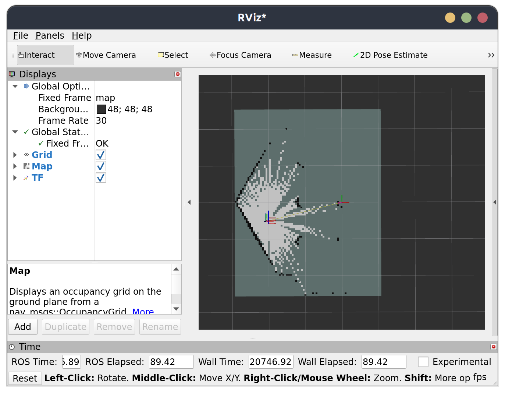
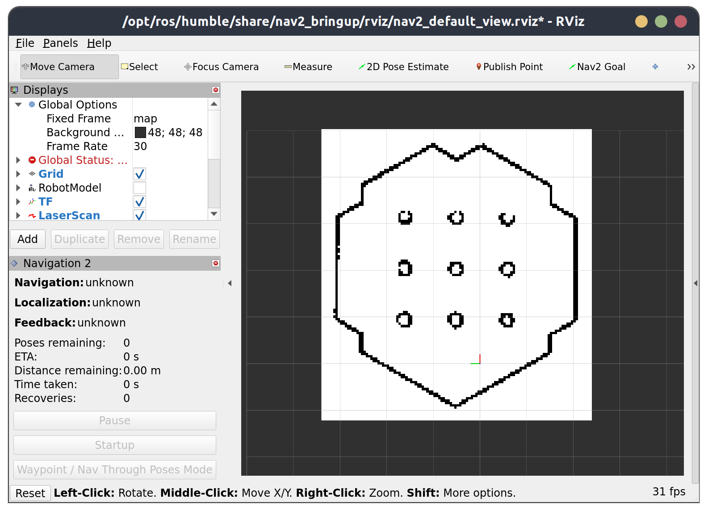

[← Back](https://rpai-lab.github.io/EE211-25Fall/course-materials/)


<br>

# SLAM & Navigation: Turtlebot Demo in Simulation

> Last Update: 2024-10-29

<br>

<!-- [> Table of contents <] -->
<!-- {: .no_toc .text-delta } -->
<!--  -->
<!-- 1. TOC -->
<!-- {:toc} -->
<!-- {:.no_toc} -->
<!-- --- -->
<!--  -->
<!-- <br> -->
<!--  -->


## 0. Setup your Envs (Turtlebot3 in Simulation)

- **Make sure you installed gazebo**

```bash
sudo apt install ros-humble-gazebo-*
```

- **Install dependencies**

```bash
sudo apt install ros-humble-turtlebot3-gazebo ros-humble-turtlebot3-teleop ros-humble-turtlebot3-example ros-humble-turtlebot3-cartographer ros-humble-cartographer ros-humble-cartographer-ros ros-humble-slam-toolbox ros-humble-nav2-bringup
```

- **Add the following in yout shell configuration(.bashrc)**

```
source /usr/share/gazebo/setup.sh
export TURTLEBOT3_MODEL=burger
export GAZEBO_MODEL_PATH=$GAZEBO_MODEL_PATH:/opt/ros/humble/share/turtlebot3_gazebo/models
```

- **Make sure your ROS_DOMAIN_ID is unique, or turn off your wifi to avoid conflict with others' ros2 communication**

- **Check your installation**

Refresh your shell, then:

```bash
ros2 launch turtlebot3_gazebo turtlebot3_world.launch.py
```

If nothing wrong happened, you are able to interact with the gazobo simulation app:


<!--  -->

<br>
<br>


## 1. (SLAM) Building a "Map"

<br>

### a. Launch the turtlebot3 gazebo world
```bash
ros2 launch turtlebot3_gazebo turtlebot3_world.launch.py
```

<br>

### b. Launch SLAM Algorithms
<!-- ### b. Launch turtlebot3 cartographer -->

- **Option 1: turtlebot3 cartographer**
> Cartographer is a system that provides real-time simultaneous localization and mapping (SLAM) in 2D and 3D across multiple platforms and sensor configurations.
>
> - https://github.com/cartographer-project
> - https://ros2-industrial-workshop.readthedocs.io/en/latest/_source/navigation/ROS2-Cartographer.html

```bash
ros2 launch turtlebot3_cartographer cartographer.launch.py
````
Rviz2 will be opened and should be look like this:


<!--  -->

- **Option 2: slam toolbox**
> Slam Toolbox is a easy-to-use slam project for ROS, desinged for lifelong mapping and localization in potentially massive maps.
>
> - https://github.com/SteveMacenski/slam_toolbox

```bash
ros2 launch slam_toolbox online_async_launch.py 
````

Then, open another terminal to open rviz2, then configure your rviz2 manually:


<!--  -->

<br>

### c. Control the robot to move around the environment to build the map

```bash
ros2 run turtlebot3_teleop teleop_keyboard # or: ros2 run teleop_twist_keyboard teleop_twist_keyboard
```

Drive the robot until the map is fully constructed:


<!--  -->

<br>

### d. Save the map

```bash
ros2 run nav2_map_server map_saver_cli -f tb3_map
```

Run the above command, and the map (a pgm picture file and a yaml file) will be saved in your current working directory.
<br>

You are encouraged to run `ros2 run nav2_map_server map_saver_cli --help` to check the detailed usage of `map_saver_cli`, the output should be like this:

```bash                 
Usage:
  map_saver_cli [arguments] [--ros-args ROS remapping args]

Arguments:
  -h/--help
  -t <map_topic>
  -f <mapname>
  --occ <threshold_occupied>
  --free <threshold_free>
  --fmt <image_format>
  --mode trinary(default)/scale/raw

NOTE: --ros-args should be passed at the end of command line
```

<br>
<br>


## 2. (Navigation) Use Navigation2 to Navigate the Robot
> [Download the provided ros2 nav2 package](https://raw.githubusercontent.com/RPAI-Lab/EE211-25Fall/refs/heads/24fall/assets/lab/week10/ee211-lab-week10-code-materials.zip)


### a. Place the provided `my_nav2_pkg` in the `src` folder of your colcon workspace, then build

The `my_nav2_pkg` includes a built map of the turtlebot3 world, a nav2 param yaml file, a python script, as well as a launch file for starting navigation.
```bash
my_nav2_pkg
├── launch
│   └── tb3_nav2_launch.py
├── maps
│   ├── tb3_map.pgm
│   └── tb3_map.yaml
├── my_nav2_pkg
│   ├── __init__.py
│   └── nav_to_pose.py
├── package.xml
├── params
│   └── nav2_params.yaml
├── resource
├── setup.cfg
├── setup.py
└── test
```

<br>

### b. Navigate your turtlebot3 interactively in gazebo simulation environment

<br>

#### a. Launch the turtlebot3 gazebo world
```bash
ros2 launch turtlebot3_gazebo turtlebot3_world.launch.py
```

<br>

#### b. Launch `tb3_nav2_launch.py` in `my_nav2_pkg`

- Surce your colcon workspace

- Run:
```bash
ros2 launch my_nav2_pkg tb3_nav2_launch.py
```
- If you see like this, then everything runs well; 


<!--  -->

Then, click `2D Pose Estimate` button, and set the approximate position and orientation of the robot in rviz2:


<!--  -->

Now, you can use click the `Nav2 Goal` button then set the goal position and orientation, then the robot will automatically go there:


<!--  -->

### c. Use nav2 API to automatically navigate the robot
<br>

#### a. ROS2 CLI

Try this in a now terminal, the robot will automatically reach the goal pose and orientation you just sent
```bash
ros2 action send_goal /navigate_to_pose nav2_msgs/action/NavigateToPose "{pose: {header: {frame_id: map}, pose: {position: {x: 1, y: 0}}}}" --feedback
```

**ROS2 Action:** you can think ros2 action is an advanced version of `ros2 service`, which has a feedback mechanism after a client sent `goal` to its server. To check detailed info about ros2 action, browse on the internet by yourself. 

**NavigateToPose:** run `ros2 interface show nav2_msgs/action/NavigateToPose` to see how this action file is defined.

<br>

#### b. rclpy API
> [NAV2 API Documentation](https://docs.nav2.org/commander_api/index.html)

For your final project this semester, I am sure you won't want to type the cli commands to control your robot. While, writing scripts to program your robot is a good and intuitive choice. 

There is a `nav_to_pose.py` example script provided to you, run the script and expolore what will happened.


<br>
<br>

## 3. In-class Practises

### Task 1

`ros2 launch turtlebot3_gazebo turtlebot3_world.launch.py` and `ros2 launch my_nav2_pkg tb3_nav2_launch.py` takes to steps, compose them into one launch file, then check if your launch file works well.

### Task 2

Make sure the launch file you made in Task1 works, then write a python script to program the robot to walk along a rectangle in simulation. You may find this task very helpful in your final project.

<br>

<br>

## Links for reference
- https://gitee.com/gwmunan/ros2/wikis/pages?sort_id=10322758&doc_id=4855084
- https://docs.nav2.org/index.html
- https://ros2-industrial-workshop.readthedocs.io/en/latest/_source/navigation/ROS2-Navigation.html
- https://ros2-industrial-workshop.readthedocs.io/en/latest/_source/navigation/ROS2-Cartographer.html

<br>

<br>

